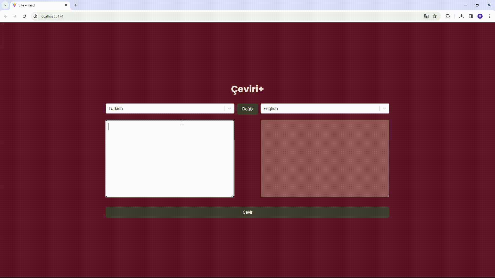

<h1>Translate-Project</h1>

Özellikler

-Uygulama, çeşitli dillerde çeviri yapma yeteneği sunar. Kullanıcılar  hedef dilleri seçerek metinleri çevirebilirler.

-"Değiş" butonu ile kaynak ve hedef dilleri hızlı bir şekilde değiştirilebilir. Bu özellik, kullanıcılara pratik bir çeviri deneyimi sunar.

-Çeviri işlemi sırasında kullanıcıya yüklenme durumu göstergesi sunulur. Bu, uzun süren çeviri işlemleri sırasında kullanıcının beklemesini sağlar.

